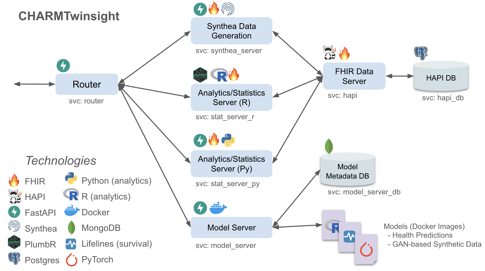

# CHARMTwinsight

## Overview

CHARMTwinsight is part of the [CHARM](https://github.com/CHARM-BDF/) suite of tools, focused on health data storage, predictive analytics, and synthetic data generation.

It is under active development, and currently supports the following features via REST API:

- Synthetic patient data generation with [Synthea](https://synthea.mitre.org/).
- Internal FHIR data storage and cohort management with [HAPI FHIR](https://hapifhir.io/).
- Data summary statistics and querying.
- Predictive analytics, supporting health risk models and synthetic data generation with GAN and similar models.

## Architecture

CHARMTwinsight is designed as a microservices architecture managed with `docker compose`. 



**`router`**: Externally-facing REST API providing access to backend services. Built with FastAPI for flexibility.

**`hapi`**: HAPI FHIR server for efficient and flexible storage and querying of FHIR data.

**`hapi_db`**: Postgres database providing storage for HAPI.

**`synthea_server`**: REST API frontend to the Synthea synthetic data generator; generates FHIR data and corresponding cohort IDs for storage in HAPI.

**`stat_server_r`**: REST API for R-based analytics (summary statistics etc.) on stored FHIR or other data. Uses `plumbr` and `fhircrackr` R libraries, amongst others.

**`stat_server_py`**: REST API for Python-based analytics (summary statistics etc.) on stored FHIR or other data. Uses `FastAPI`, `fhiry`, and other Python libraries.

**`model_server`**: REST API hosting and serving arbitrary ML and statistical models packaged as Docker containers. 

**`model_server_db`**: MongoDB database for storing metadata on hosted models.


## Installation and Usage

### 0. Prerequisites

You will need `docker`; if using a Mac install [Docker Desktop](https://www.docker.com/products/docker-desktop/).

- Mac users may also wish to install GNU versions of [coreutils](https://formulae.brew.sh/formula/coreutils)
- **Mac users may also need to enable Docker volume storage under `System Preferences -> Privacy and Security -> Files and Folders -> Docker`**

### 1. Build Application Images

First, build the images for the application with `docker compose`:

```bash
# working dir: app
docker compose build --with-dependencies router
```

If you have having trouble, you might add a `--no-cache` to force rebuilding images from scratch, and/or a `--progress plain` to see complete build progress.

### 2. Build Model Images

Next, build the default images for the model-hosting service. These default models may be complemented with other Docker-based models via the API, provided the referenced images are on the same host as the app, or available on Dockerhub or another container registry.

```bash
# working dir: app
model_server/models/build_model_images.sh
```

You can add build args to this script, e.g. `--no-cache` to force rebuilding the model images.

### 3. Start App

Using `docker compose`:

```bash
# working dir: app
docker compose up router
```

If you want to run the applicatio detached, use `docker compose up --detach router`. Adding `--force-recreate` forces the removal of existing services (by default docker compose only restarts services that have changed). The main API endpoints will be browsable at [`http://localhost/docs`](http://localhost/docs).

For development purposes, the HAPI FHIR server is exposed at [`http://localhost:8080`](http://localhost:8080); **This can be used to browse generated FHIR data and run ad-hoc queries.**

### 4. Load Models

The default set of predictive and generative models must be registered with the model server before use. 

```bash
# working dir: app
model_server/models/register_model_images.sh
```

Each model will be tested with the example inputs, returning the generated results.


### 5. Generate Synthetic Data

Synthetic patient data in FHIR format may be generated via a POST request to http://localhost/synthetic/synthea/generate-synthetic-patients, with url parameters `num_patients`, `num_years`, 
and `cohort_id`. The patients will be simulated with Synthea, and their records will be tagged with the provided `cohort_id` (defaulting to `default`).

It is possible to re-use the same cohort ID across multiple generations, in which case newly generated patients will be added to the cohort.

A testing script demonstrates this, creating a `cohort1` with 6 members, and a `cohort2` with 3. Each generation takes a few seconds.

```bash
# working dir: app
synthea_server/gen_patients.sh
```

These data are pushed to the FHIR server accessible at `http://localhost:8080` for development purposes.

